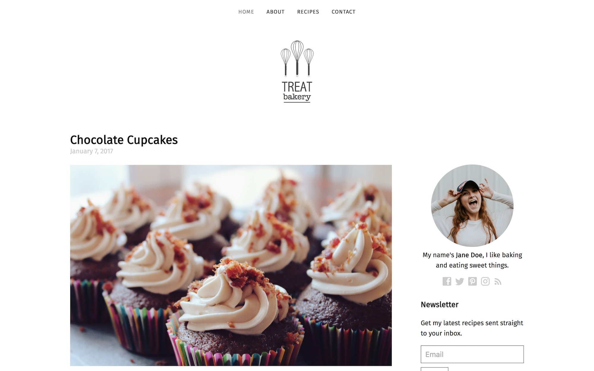

# Treat

Food/baking blog template for Jekyll. Browse through a [live demo](https://spring-bat.cloudvent.net/).

Treat was made by [CloudCannon](http://cloudcannon.com/), the Cloud CMS for Jekyll.

Find more templates, themes and step-by-step Jekyll tutorials at [CloudCannon Academy](https://learn.cloudcannon.com/).

## Features

* Contact form
* Pre-built pages
* Pre-styled components
* Blog with pagination
* Disqus comments for posts
* Configurable sidebar
* Optimised for editing in [CloudCannon](http://cloudcannon.com/)
* RSS/Atom feed
* SEO tags
* Google Analytics

## Setup

1. Add your site and author details in `_config.yml`.
2. Add your Google Analytics, Disqus and MailChimp keys to `_config.yml`.
3. Add your details to `_data/sidebar.yml`
4. Get a workflow going to see your site's output (with [CloudCannon](https://app.cloudcannon.com/) or Jekyll locally).

## Develop

Treat was built with [Jekyll](http://jekyllrb.com/) version 3.4.3, but should support newer versions as well.

Install the dependencies with [Bundler](http://bundler.io/):

~~~bash
$ bundle install
~~~

Run `jekyll` commands through Bundler to ensure you're using the right versions:

~~~bash
$ bundle exec jekyll serve
~~~

## Editing

Treat is already optimised for adding, updating and removing recipes, navigation, page content, and sidebar information in CloudCannon.

### Posts/Recipes

* Add, update or remove a post in the *Posts* collection.
* The recipes page is organised by categories.
* Change the defaults when new posts are created in `_posts/_defaults.md`.

### Contact Form

* Preconfigured to work with CloudCannon, but easily changed to another provider (e.g. [FormSpree](https://formspree.io/)).
* Sends email to the address listed in company details.

### Navigation

* Exposed as a data file to give clients better access.
* Set in the *Data* / *Navigation* section.

### Footer

* Exposed as a data file to give clients better access.
* Set in the *Data* / *Footer* section.
